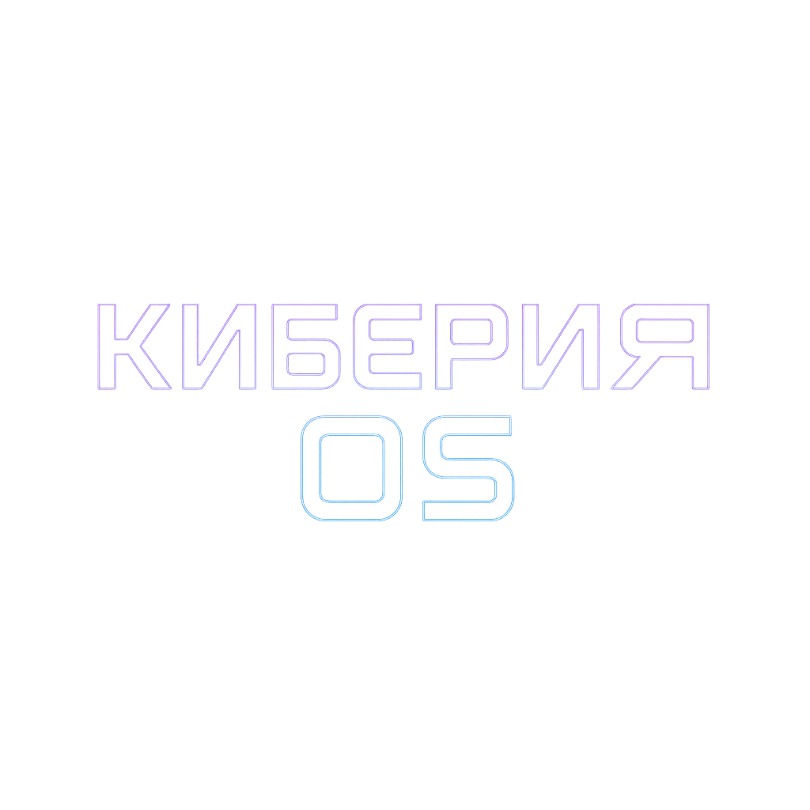

# Cyberia OS

Cyberia OS emerges as a lighter, leaner alternative to Kali Linux and other distributions geared toward penetration testing and hacking.
The project offers a script that transforms Debian 12 into a customized version of Cyberia OS, adding essential tools and tweaks for security testing. It also provides ready-to-use .iso images and virtual machines, making it easy to run the distro anywhere, anytime.

**Usage**: 

```bash
# On a bare Debian 12 installation:
./setup.sh
```

## Hacking Tools

* Exiftool
* Lynx
* Wafw00f
* Sqlmap
* John The Ripper
* Hydra
* Whois
* Scapy
* Hping3
* Whatweb
* Aircrack-ng
* Httrack
* Recon-ng
* TheHarvester
* Gophish
* Spiderfoot
* Setoolkit
* Ghidra
* Ffuf
* Feroxbuster
* Urlcrazy
* DotDotPwn
* XSStrike
* Burp Suite
* OWASP ZAP
* Nikto
* Metasploit
* SecLists

## Network Tools

* Network Manager Gnome
* Ipcalc
* Netcat (OpenBSD)
* Ncat
* Telnet
* Nmap
* Net-tools
* Bind9-dnsutils
* Tcpdump
* Wireshark
* Tor
* Proxychains
* Traceroute
* Tcptraceroute
* Openvpn

## Programming Languages

* Python 3.7, 3.11 and 3.12.4 (Pyenv)
* Golang 1.24.5
* Java 24.0.2
* Ruby

## Other Utils

* Firefox
* Google Chrome
* Terminator
* Vim
* Wget
* Curl
* Libre Office
* VLC
* GIMP
* VSCode
* Jq

